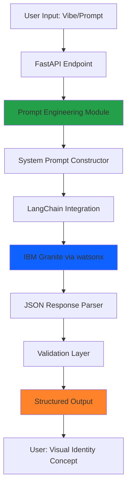
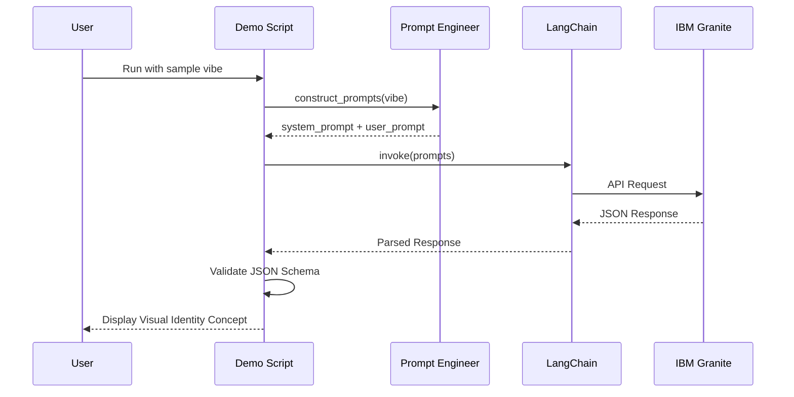

# Implementation Plan: AI-Powered eSports Branding Generator

## Project Overview

**Challenge Theme:** Reimagine Creative Industries with AI  
**Project Name:** AI-Powered eSports Branding & Visual Concept Generator  
**Tech Stack:** Python + FastAPI + LangChain + IBM Granite (watsonx)  
**Development Tool:** IBM Bob

---

## Architecture Overview



---

## Project Structure

```
Reimagine Creative Industries with AI - AI-Powered eSports Branding & Visual Concept Generator/
├── src/
│   ├── __init__.py
│   ├── main.py                    # FastAPI application entry point
│   ├── config.py                  # Configuration management
│   ├── models/
│   │   ├── __init__.py
│   │   └── schemas.py             # Pydantic models for request/response
│   ├── services/
│   │   ├── __init__.py
│   │   ├── prompt_engineer.py    # AI prompt construction logic
│   │   └── llm_service.py        # LangChain + IBM Granite integration
│   └── utils/
│       ├── __init__.py
│       └── validators.py          # JSON schema validation
├── tests/
│   ├── __init__.py
│   └── test_prompt_engineer.py
├── examples/
│   └── api_integration_demo.py    # Mockup demonstration script
├── .env.template                   # Environment variables template
├── .gitignore
├── requirements.txt
├── README.md
└── IMPLEMENTATION_PLAN.md
```

---

## Task 1: Project Initialization

### Directory Structure Setup

Create the following directories and files:
- `src/` - Main application code
- `src/models/` - Data models and schemas
- `src/services/` - Business logic and AI integration
- `src/utils/` - Helper functions and validators
- `tests/` - Unit tests
- `examples/` - Demo scripts

### Requirements.txt Dependencies

```txt
# Web Framework
fastapi==0.109.0
uvicorn[standard]==0.27.0
pydantic==2.5.3
pydantic-settings==2.1.0

# AI/LLM Integration
langchain==0.1.4
langchain-ibm==0.1.0
ibm-watsonx-ai==0.2.0

# HTTP & API
requests==2.31.0
httpx==0.26.0

# Environment Management
python-dotenv==1.0.0

# Data Validation
jsonschema==4.20.0

# Development Tools
pytest==7.4.4
pytest-asyncio==0.23.3
black==24.1.1
```

---

## Task 2: AI Prompt Engineering Logic

### System Prompt Architecture

The prompt engineering module will construct a sophisticated system prompt that:

1. **Defines the AI's Role**: Expert eSports art director
2. **Specifies Output Format**: Structured JSON with exact schema
3. **Provides Context**: eSports industry trends, gaming aesthetics
4. **Sets Constraints**: Color theory for gradients, typography pairing rules

### Prompt Components

```python
# Pseudo-structure of prompt_engineer.py

class PromptEngineer:
    def __init__(self):
        self.system_role = "Expert eSports Art Director"
        self.output_format = "JSON"
        
    def construct_system_prompt(self) -> str:
        """
        Builds the system prompt with:
        - Role definition
        - Industry context (eSports, gaming, streaming)
        - Output schema requirements
        - Design principles (gradients, typography, layouts)
        """
        
    def construct_user_prompt(self, user_vibe: str) -> str:
        """
        Formats user input into structured prompt
        """
        
    def get_json_schema(self) -> dict:
        """
        Returns expected JSON output schema
        """
```

### Expected JSON Output Schema

```json
{
  "theme_name": "string (catchy branding concept name)",
  "color_palette": [
    "#HEX1",
    "#HEX2",
    "#HEX3",
    "#HEX4",
    "#HEX5"
  ],
  "typography": {
    "primary_display": "Font Name (aggressive/bold)",
    "secondary_body": "Font Name (clean/modern like Quicksand)",
    "pairing_rationale": "Why these fonts work together"
  },
  "layout_guidelines": {
    "streaming_overlay": "Specific recommendations for OBS/stream overlays",
    "social_media_banner": "Design concepts for Twitter/Instagram headers",
    "text_masking_concepts": "Creative text-masking techniques"
  }
}
```

---

## Task 3: API Integration Mockup

### Demo Script Structure

The [`examples/api_integration_demo.py`](examples/api_integration_demo.py) will demonstrate:

1. **Environment Setup**: Loading API keys from `.env`
2. **Prompt Construction**: Using the prompt engineering module
3. **LLM Communication**: Sending request to IBM Granite via LangChain
4. **Response Parsing**: Extracting and validating JSON
5. **Error Handling**: Graceful failure management

### Flow Diagram



### Key Features

- **Async/Await Support**: For efficient API calls
- **Retry Logic**: Handle transient failures
- **Response Validation**: Ensure JSON matches schema
- **Pretty Printing**: Display results in readable format

---

## Task 4: GitHub README Drafting

### README Structure

The [`README.md`](README.md) will include:

#### 1. Project Header
- Project title with logo/banner
- Challenge badge
- Tech stack badges

#### 2. Problem Statement
- Current challenges in eSports branding
- Manual design process inefficiencies
- Need for rapid concept generation

#### 3. Solution Description
- AI-powered creative assistant
- Automated visual identity generation
- Structured output for designers

#### 4. AI Approach & Architecture
- IBM Granite model selection rationale
- Prompt engineering strategy
- JSON-structured output design
- Integration with watsonx

#### 5. Challenge Theme
- "Reimagine Creative Industries with AI"
- How this project transforms creative workflows
- Impact on eSports industry

#### 6. IBM Bob Development Process
- How Bob was used for:
  - Project planning and architecture
  - Code generation and structure
  - Prompt engineering refinement
  - Documentation creation
  - Testing strategy

#### 7. Features
- Input: Natural language "vibe" descriptions
- Output: Complete visual identity concepts
- Components: Colors, typography, layouts

#### 8. Installation & Usage
- Prerequisites
- Setup instructions
- API endpoint documentation
- Example requests/responses

#### 9. Technical Details
- Project structure
- Key modules explanation
- Configuration options

#### 10. Demo & Examples
- Sample inputs and outputs
- Screenshots/visualizations
- Link to demo video

#### 11. Future Enhancements
- Image generation integration
- Real-time preview
- Design asset export

#### 12. Contributing & License
- Contribution guidelines
- License information

---

## Implementation Sequence

### Phase 1: Foundation (Tasks 1-2)
1. Create directory structure
2. Initialize Python package
3. Set up [`requirements.txt`](requirements.txt)
4. Implement prompt engineering module
5. Create Pydantic schemas

### Phase 2: Integration (Task 3)
1. Implement LangChain service
2. Configure IBM Granite connection
3. Create demo script
4. Add validation logic
5. Test end-to-end flow

### Phase 3: Documentation (Task 4)
1. Draft README sections
2. Create architecture diagrams
3. Document API endpoints
4. Add usage examples
5. Include IBM Bob development notes

---

## Key Design Decisions

### 1. FastAPI over Flask
- **Rationale**: Modern async support, automatic API documentation, type safety
- **Benefits**: Better performance, built-in validation, OpenAPI schema

### 2. LangChain Integration
- **Rationale**: Abstraction layer for LLM interactions, easier prompt management
- **Benefits**: Simplified IBM Granite integration, prompt templating, response parsing

### 3. Structured JSON Output
- **Rationale**: Predictable, parseable, programmatically usable
- **Benefits**: Easy validation, clear contract, downstream integration

### 4. Modular Architecture
- **Rationale**: Separation of concerns, testability, maintainability
- **Benefits**: Easy to extend, clear responsibilities, reusable components

---

## Success Criteria

- ✅ Clean, modular Python project structure
- ✅ Working prompt engineering function
- ✅ Functional API integration demo
- ✅ Comprehensive README meeting all challenge requirements
- ✅ Code is readable, well-documented, and testable
- ✅ Clear explanation of IBM Bob's role in development

---

## Next Steps

After plan approval, switch to **Code mode** to implement:

1. Project structure and [`requirements.txt`](requirements.txt)
2. Prompt engineering module ([`src/services/prompt_engineer.py`](src/services/prompt_engineer.py))
3. LLM service integration ([`src/services/llm_service.py`](src/services/llm_service.py))
4. API demo script ([`examples/api_integration_demo.py`](examples/api_integration_demo.py))
5. Comprehensive [`README.md`](README.md)

Each component will be implemented with proper error handling, type hints, and documentation.